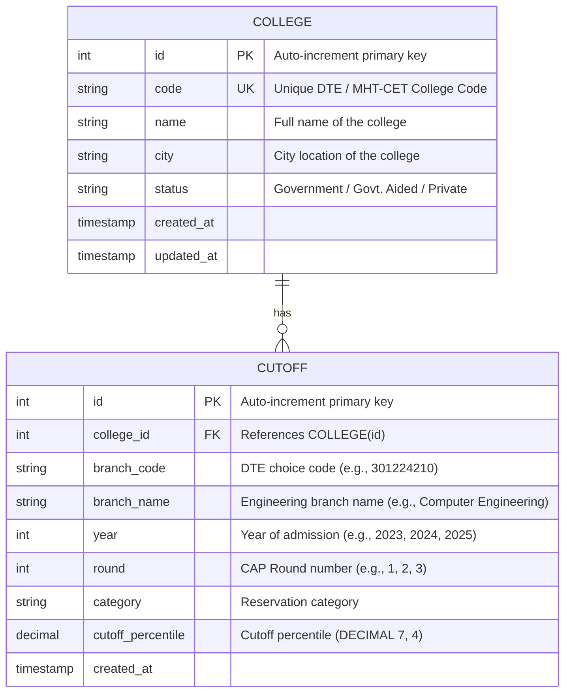

# MHT CET College Recommendation & Admission Analytics System
## Database Design Document (Day 1 Deliverable)

This document outlines the detailed system features, prediction logic, database schema, and entity-relationship (ER) design for the MHT CET College Recommendation & Admission Analytics System.

---

## 1. System Features & Specifications

The system is designed to help engineering aspirants in Maharashtra analyze past MHT CET cutoff trends and predict their admission chances. The core features are:

### A. Enter Percentile
* **Input Type**: Decimal number.
* **Validation**: Must be between `0.0000` and `100.0000` (inclusive). MHT CET percentiles are calculated up to 7 decimal places (e.g., `99.8942`). The input UI and database must support this precision.

### B. Select Category
* **Description**: Users select their reservation category.
* **Categories Supported**:
  * `OPEN` (General / Open Category)
  * `OBC` (Other Backward Class)
  * `SC` (Scheduled Caste)
  * `ST` (Scheduled Tribe)
  * `EWS` (Economically Weaker Section)
  * `TFWS` (Tuition Fee Waiver Scheme)
  * Special seat types (e.g., Defensive, PwD, Home University vs. Other Than Home University) will be mapped appropriately.

### C. Safe / Moderate / Dream Classification
Based on the user's entered percentile ($P_{user}$) and category, the algorithm compares it against historical cutoff percentiles ($C_{cutoff}$) for the same category. Colleges are classified as follows:
* **Safe** ($C_{cutoff} < P_{user} - 3.0$):
  High probability of admission. The cutoff is significantly lower than the candidate's score.
* **Moderate** ($P_{user} - 3.0 \le C_{cutoff} \le P_{user} + 1.0$):
  Moderate probability of admission. The cutoff is within a competitive range of the candidate's score.
* **Dream** ($C_{cutoff} > P_{user} + 1.0$):
  Low probability of admission (aspirational). The cutoff is higher than the candidate's score.

### D. College Search & Filtering
* Users can search for colleges by name or city.
* Filters available: Branch name (e.g., Computer Engineering, IT, Mechanical), College Status (Government, Private, Government-Aided).

---

## 2. Entity-Relationship (ER) Diagram

The system uses a relational database schema optimized for fast query execution and analytics.

---

## 3. Database Schema Specifications

### Table 1: `colleges`
Stores metadata for engineering colleges participating in the MHT CET Centralized Admission Process (CAP).

| Column Name | Data Type | Constraints | Description |
| :--- | :--- | :--- | :--- |
| `id` | `INT` | `PRIMARY KEY`, `AUTO_INCREMENT` | Unique identifier. |
| `code` | `VARCHAR(10)` | `UNIQUE`, `NOT NULL` | DTE College Code (e.g., `3012` for VJTI). |
| `name` | `VARCHAR(255)` | `NOT NULL` | Full college name. |
| `city` | `VARCHAR(100)` | `NOT NULL` | City name. |
| `status` | `VARCHAR(50)` | `NOT NULL` | Government, Government Aided, or Private. |
| `created_at` | `TIMESTAMP` | `DEFAULT CURRENT_TIMESTAMP` | Audit timestamp. |
| `updated_at` | `TIMESTAMP` | `DEFAULT CURRENT_TIMESTAMP ON UPDATE CURRENT_TIMESTAMP` | Audit timestamp. |

### Table 2: `cutoffs`
Stores historical cutoff records per branch, category, round, and year.

| Column Name | Data Type | Constraints | Description |
| :--- | :--- | :--- | :--- |
| `id` | `INT` | `PRIMARY KEY`, `AUTO_INCREMENT` | Unique identifier. |
| `college_id` | `INT` | `FOREIGN KEY`, `NOT NULL` | References `colleges(id)` with cascade delete. |
| `branch_code` | `VARCHAR(20)` | `NOT NULL` | DTE Choice Code (e.g., `301224210`). |
| `branch_name` | `VARCHAR(255)` | `NOT NULL` | Engineering branch name (e.g., Computer Engineering). |
| `year` | `INT` | `NOT NULL` | Admission year (e.g., `2023`, `2024`). |
| `round` | `INT` | `NOT NULL` | CAP Round number (`1`, `2`, or `3`). |
| `category` | `VARCHAR(50)` | `NOT NULL` | Reservation category (e.g., `OPEN`, `OBC`, `SC`). |
| `cutoff_percentile` | `DECIMAL(7, 4)` | `NOT NULL` | The cutoff percentile score. |
| `created_at` | `TIMESTAMP` | `DEFAULT CURRENT_TIMESTAMP` | Audit timestamp. |

#### Database Indexes for Query Optimization
To ensure the prediction query performs efficiently over large datasets (10,000+ cutoff records):
1. **Index on `cutoffs(category, cutoff_percentile)`**: Speeds up the range queries filtering by category and cutoff percentile values.
2. **Index on `cutoffs(college_id)`**: Speeds up JOIN operations between `colleges` and `cutoffs`.
3. **Composite Index on `cutoffs(year, round)`**: For filtering specific admission cycles.
